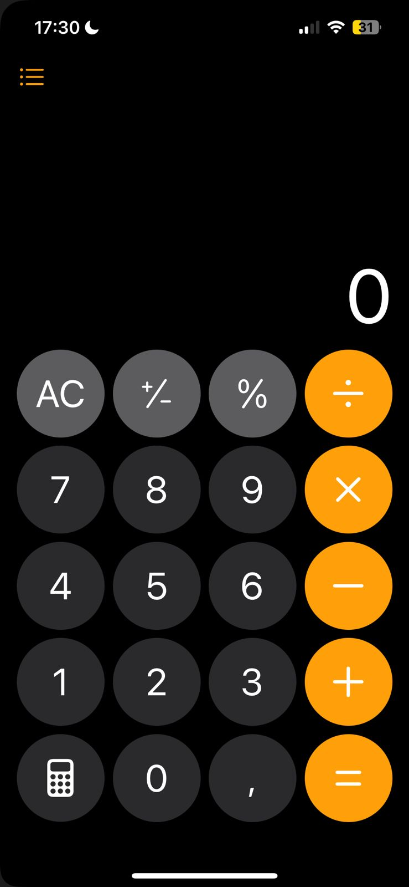
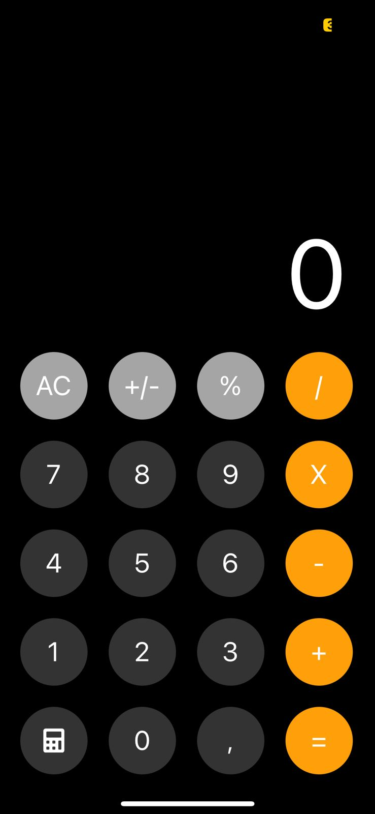

# iOS Calculator Replica

Este projeto é uma réplica da calculadora do iOS, criada utilizando **React Native** e **Expo**. O objetivo é recriar a interface e funcionalidades principais da calculadora do iOS, permitindo uma experiência visual e funcional similar à do aplicativo original.

## 📱 Visão Geral

A aplicação simula a aparência e o funcionamento de uma calculadora básica encontrada no iOS. Com botões arredondados, display de valores, e suporte a operações aritméticas como adição, subtração, multiplicação e divisão, esta réplica busca reproduzir a experiência original com um design elegante e intuitivo.

## ⚙️ Funcionalidades

- **Operações Aritméticas Básicas**: Suporta operações de adição, subtração, multiplicação e divisão.
- **Interface de Botões Personalizada**: Botões estilizados para se assemelhar à calculadora do iOS.
- **Funções Extras**: Cálculo de porcentagem, inversão de sinal, e função de limpar tudo (AC).
- **Experiência de UI/UX Similar ao iOS**: Design responsivo e estético com botões de cores e tamanhos similares.

## 🛠️ Tecnologias Utilizadas

- **React Native** - Estrutura principal para o desenvolvimento de aplicativos móveis.
- **Expo** - Ambiente para facilitar o desenvolvimento e testes.
- **TypeScript** - Para tipagem e maior confiabilidade do código.
- **@expo/vector-icons** - Para ícones personalizados, como o ícone de calculadora.

## 📸 Capturas de Tela

